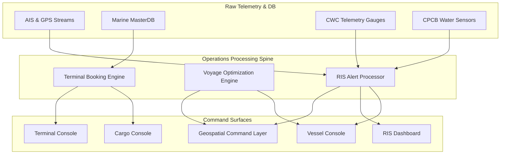

# Command Center Information Architecture
## Namami Gange Marine Operations Command Center (MOCC)

This document establishes the structural, navigational, and logical architecture for the evolved Namami Gange Marine Operations Command Center. The MOCC transitions the platform from a static location suitability dashboard to an active, real-time command surface for waterway traffic, cargo logistics, River Information Services (RIS), and voyage optimization.

---

## 1. Unified Interface Overview

The MOCC integrates six distinct operational zones into a unified, high-density, dark-mode visual interface. This interface serves the dual needs of high-frequency monitoring (tactical operators) and strategic risk mitigation (harbor masters and directors).


---

## 2. Dedicated Operational Zones

The command center workspace is organized into six functional panels, each with its own specialized telemetry feeds, action overrides, and alert structures:

### A. River Operations Zone
* **Objective**: Maintain situational awareness of the physical waterway draft, hydrological trends, and environmental compliance.
* **Telemetry Feeds**: Central Water Commission (CWC) telemetry gauges, bathymetric sonar scans, and CPCB real-time water quality indexes.
* **Key Indicators**: Active shoaling warnings, dredging progress, lock gate water levels, draft status at bottlenecks.
* **Critical Actions**: Dispatch dredging requests, open/close lock gate overrides.

### B. Vessel Operations Zone
* **Objective**: Track active vessel transits, Class distributions, and route compliance.
* **Telemetry Feeds**: Automatic Identification System (AIS) transponders, shore-based radar networks, vessel GPS trackers.
* **Key Indicators**: Vessel status tables (Underway, Moored, Anchored), class breakdown (Class I–VII), speed over ground (SOG), ETA tracking, course deviations.
* **Critical Actions**: Broadcast speed limit alerts, dispatch emergency patrol boats.

### C. Cargo Operations Zone
* **Objective**: Monitor freight corridors, terminal commodity loading, and logistics efficiency.
* **Telemetry Feeds**: Terminal MasterDB, port cargo manifests, customs clearing systems, and road-rail truck arrival feeds.
* **Key Indicators**: Cargo volume throughput (in metric tons), type breakdowns (fly ash, coal, container, agri-bulk), yard capacity, cargo transit times.
* **Critical Actions**: Reallocate cargo routes, flag terminal freight congestion.

### D. Terminal Operations Zone
* **Objective**: Manage inland waterway terminals, jetty berth bookings, and vessel turnaround times.
* **Telemetry Feeds**: Terminal Operating System (TOS) APIs, berth cameras, crane telemetry, and local truck queues.
* **Key Indicators**: Jetty booking schedule calendar, berth utilization rates, crane operation speed, terminal waiting times.
* **Critical Actions**: Approve jetty booking requests, override slot schedules, assign pilotage services.

### E. Navigation Operations Zone (RIS Command Center)
* **Objective**: Enforce River Information Services (RIS) standards, broadcast notices, and manage channel safety.
* **Telemetry Feeds**: European RIS-compliant Notice to Mariners (NtM) data streams, Electronic Ship Reporting (ERI), meteorological alerts.
* **Key Indicators**: Active navigation warnings, speed limit zones, meteorological advisories, pontoon/bridge vertical clearance levels.
* **Critical Actions**: Publish Notices to Mariners, declare emergency channel closures.

### F. System Operations Zone
* **Objective**: Ensure high-availability telemetry ingestion, schema compliance, and deterministic replay loops.
* **Telemetry Feeds**: Apache Kafka message rates, validation engine logs, sync state latency metrics.
* **Key Indicators**: Message ingestion rate (msg/s), schema validation error rate, database sync delay (ms).
* **Critical Actions**: Initiate telemetry replay mode, force schema validation reconciliation buffers, toggle backup failover servers.

---

## 3. Data Integration & Stream Topology

The diagram below outlines how the integration team's components feed into the MOCC:



---

## 4. Role-Based Access Architecture

Different console views are tailored to specific user personas:

| Operator Persona | Primary Zones | Permitted Overrides |
| :--- | :--- | :--- |
| **Tactical Traffic Controller** | Vessel Ops, Navigation Ops | Dispatch speed alerts, update vessel ETA |
| **Logistics Planner** | Cargo Ops, Voyage Planning | Route optimization, cargo corridor reallocation |
| **Terminal Superintendent** | Terminal Ops, Cargo Ops | Jetty berth allocation, slot schedule overrides |
| **Hydrographer & RIS Admin** | River Ops, Navigation Ops | Notice to Mariners publication, channel depth alert broadcast |
| **System Operations Engineer** | System Ops, Infrastructure | Replay trigger, schema fallback override |

---

## 5. Screen Layout & Navigation Map

The application uses a persistent left navigation sidebar and a top contextual KPI ribbon to allow 1-click switching between screens, with a fallback notification hub displaying high-priority alerts globally:

```
+---------------------------------------------------------------------------------------+
|  LOGO  | KPIs: Active Vessels (12) | Cargo Vol (45K MT) | Alerts (2) | MODEL SELECT   |
+---------------------------------------------------------------------------------------+
| ( )    |                                                                              |
| River  |  +-------------------------------------+  +--------------------------------+ |
|        |  |                                     |  |                                | |
| (•)    |  |                                     |  |     Contextual Detail Card     | |
| Vessel |  |                                     |  |     (Selected Object Details)  | |
|        |  |                                     |  |                                | |
| ( )    |  |        Main Workspace Pane          |  +--------------------------------+ |
| Cargo  |  |      (Interactive Map / Grid /      |                                     |
|        |  |         Console Tables)             |  +--------------------------------+ |
| ( )    |  |                                     |  |                                | |
| Term   |  |                                     |  |     Live Teleplay Console      | |
|        |  |                                     |  |      (Ledger & Event Logs)     | |
| ( )    |  +-------------------------------------+  +--------------------------------+ |
| RIS    |                                                                              |
+---------------------------------------------------------------------------------------+
```
